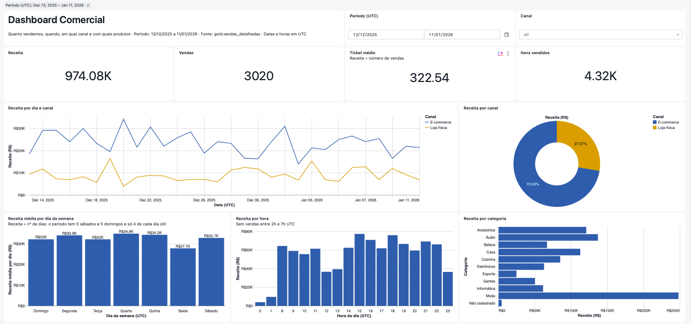
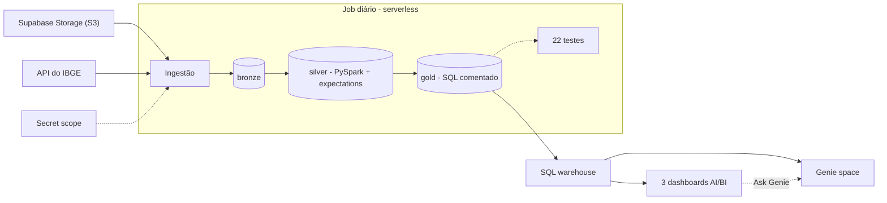
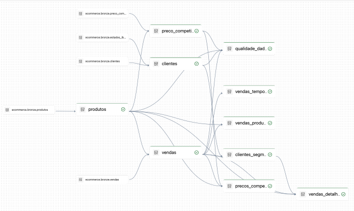
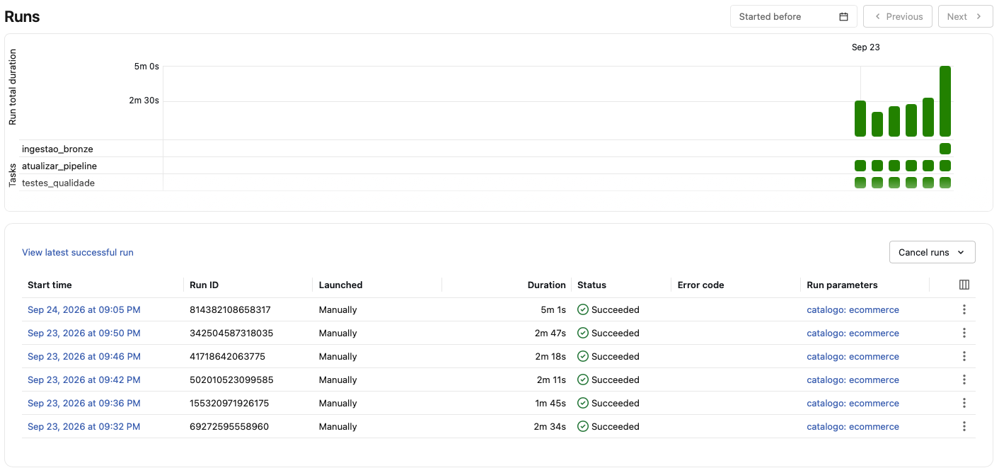
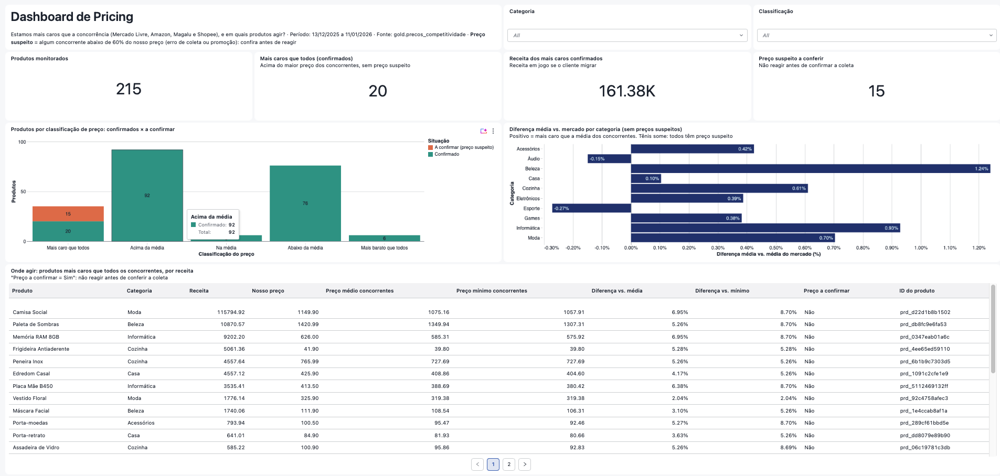
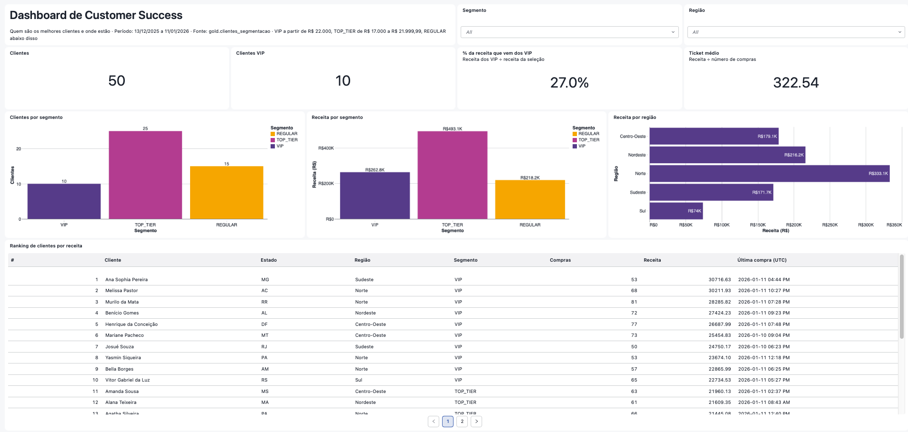
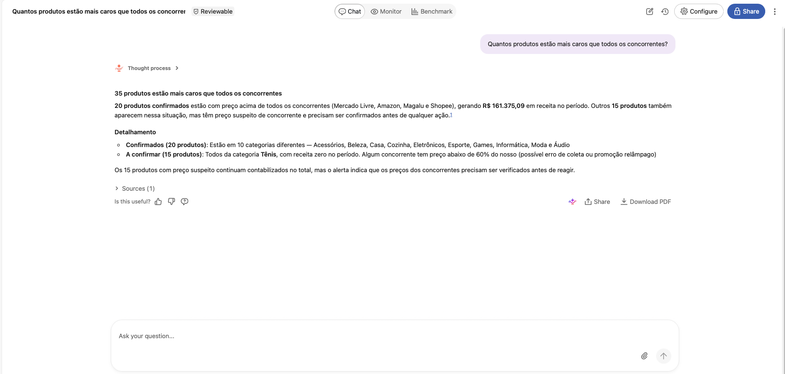

# Pipeline de e-commerce no Databricks: da ingestão ao Genie

Pipeline de dados de ponta a ponta para um e-commerce brasileiro: ingestão de um data lake S3, arquitetura medalhão no Unity Catalog com qualidade de dados declarada, testes automáticos, um dashboard por diretoria e um agente do **Genie** que responde em português. Tudo descrito como código num **Databricks Asset Bundle**, com ambientes `dev` e `prod`, 100% serverless.



---

## O problema

Uma loja que vende online e em loja física tem três diretores com perguntas diferentes:

| Diretoria | Pergunta |
|---|---|
| **Comercial** | Quanto vendemos, quando, em qual canal e com quais produtos? |
| **Customer Success** | Quem são os melhores clientes e onde eles estão? |
| **Pricing** | Estamos mais caros que a concorrência (Mercado Livre, Amazon, Magalu, Shopee)? Em quais produtos agir? |

Antes, cada resposta dependia de alguém baixar arquivos, escrever SQL solto e lembrar das armadilhas do dado: vendas de produtos que não existem no catálogo, produtos diferentes com o mesmo nome, preços de concorrente coletados pela metade. Um `INNER JOIN` descuidado derruba a receita de R$ 974.077,28 para R$ 969.837,27 sem nenhum aviso.

**O que o projeto entrega:** o dado chega sozinho todo dia, cada problema de qualidade é **marcado e medido, nunca apagado**, 22 testes deixam o Job vermelho se um número não bater, cada diretor tem o seu dashboard e pode perguntar direto ao Genie.

## Arquitetura



| Camada | O que guarda | Como |
|---|---|---|
| **Bronze** | O dado como chegou: 4 arquivos Parquet + 27 UFs do IBGE | Notebook Python (`boto3`, `pandas`), carga full, credenciais no secret scope |
| **Silver** | Dado confiável: tipos, chaves, receita, calendário, região; problemas marcados em colunas | 4 materialized views em PySpark, 19 expectations (*fail* para o impossível, *warn* para o tolerado) |
| **Gold** | Uma tabela por pergunta de diretoria, uma tabela larga por venda e o placar de qualidade | 6 materialized views em SQL, com tipo e comentário em todas as colunas |
| **Consumo** | Dashboards Comercial, Customer Success e Pricing; Genie para as três diretorias | AI/BI Dashboards e AI/BI Genie sobre o SQL warehouse |

Detalhes, diagrama completo e 12 decisões registradas em [docs/ARQUITETURA.md](docs/ARQUITETURA.md).

**O pipeline no Databricks.** Ninguém escreveu a ordem das tabelas: o pipeline deduz as dependências a partir do código de cada uma (bronze à esquerda, silver no meio, golds à direita).



**O Job em execução.** Ingestão, pipeline e testes, em sequência; a tarefa seguinte só começa se a anterior terminar bem.



## Stack

Databricks (Unity Catalog, Delta Lake, Lakeflow Declarative Pipelines, Lakeflow Jobs, AI/BI Dashboards, AI/BI Genie, serverless) · PySpark e Spark SQL · Python (`boto3`, `pandas`, `requests`) · Databricks Asset Bundles e Databricks CLI · Git · Claude Code com o plugin Databricks e o MCP de SQL gerenciado.

## Resultados

**Números conferidos direto na gold**

| Diretoria | Resultado |
|---|---|
| Comercial | R$ 974.077,28 de receita em 3.020 vendas (ticket médio R$ 322,54); o e-commerce responde por 2.155 vendas e R$ 705.486,21 |
| Customer Success | 50 clientes; 10 VIP concentram 27,0% da receita; Norte é a região de maior receita (R$ 333.078,69, 17 clientes) |
| Pricing | 35 produtos mais caros que todos os concorrentes: **20 confirmados** (R$ 161.375,09 de receita) e **15 com preço suspeito**, todos de Tênis e sem nenhuma venda |

O caso do Tênis mostra por que "marcar e não apagar" importa: a categoria aparece **+100% acima do mercado**, mas o concorrente cobra exatamente metade do nosso preço, o que indica erro de coleta. Sem os suspeitos, a categoria mais cara é Beleza, com +1,24%. A ação é conferir a coleta, não baixar o preço.



O Dashboard de Customer Success mostra a carteira por segmento e região e o ranking de clientes:



**Placar de qualidade** (`gold.qualidade_dados`): 20 vendas de produto não cadastrado (R$ 4.240,01, mantidas na receita), 5 vendas antes do cadastro do produto, 55 preços de concorrente suspeitos, 12 produtos com marca diferente da citada no nome, 11 nomes de cliente com pronome de tratamento corrigidos.

**Genie:** aceitação com 12 perguntas de resposta conhecida, feitas pela API de conversa e comparadas com SQL direto na gold. Só conta acerto se o texto trouxer todos os números.

| Rodada | Aceitação | Perguntas de limite ("lucro?", "ontem?") | Ajuste que veio do erro |
|---|---|---|---|
| 1 | 9/10 | 2/2 | Região sem o número de clientes |
| 2 | 8/10 | 2/2 | Filtrou antes de ranquear em "dos 10 que mais faturam…" → regra "top N antes do filtro" |
| 3–4 | 10/10 | 2/2 | — |
| 5 | 10/10 | 2/2 | Com o placar de qualidade no space, inventou uma regra própria (183 no lugar de 12) → SQL de exemplo e *entity matching* |
| 6 | 10/10 | 2/2 | Também 6/6 perguntas da tela inicial e 2/2 de qualidade |

Uma das perguntas de aceitação, respondida pelo Genie com o número total, a separação entre confirmados e suspeitos e a categoria dos suspeitos:



## Decisões principais

| Decisão | Por quê | ADR |
|---|---|---|
| Materialized views, não streaming tables | A bronze é sobrescrita a cada carga; a MV relê e recalcula | [002](docs/ARQUITETURA.md#adr-002--materialized-view-e-não-streaming-table) |
| Marcar e medir, nunca descartar | Dinheiro que entrou é receita; o problema fica visível e medido | [003](docs/ARQUITETURA.md#adr-003--marcar-e-medir-nunca-descartar) |
| Gold por pergunta + tabela larga, sem star schema | Consumidores são dashboards SQL e um agente text-to-SQL, que erra menos com poucas tabelas bem comentadas | [005](docs/ARQUITETURA.md#adr-005--gold-por-pergunta--tabela-larga-sem-star-schema) |
| Comentários da gold como contrato com o Genie | O Genie só sabe o que está nas tabelas; um teste falha se faltar comentário ou se o período mudar | [006](docs/ARQUITETURA.md#adr-006--comentários-da-gold-como-contrato-com-o-genie-com-período-vigiado) |
| Tudo como código, inclusive dashboards e Genie | Revisável e reprodutível; o Genie usa `${var.catalog}` e vale para dev e prod | [007](docs/ARQUITETURA.md#adr-007--tudo-como-código-num-asset-bundle-inclusive-dashboards-e-genie) |

## Como executar

**Pré-requisitos**
- Um workspace Databricks com Unity Catalog e SQL warehouse serverless chamado *Serverless Starter Warehouse* (o [Free Edition](https://www.databricks.com/learn/free-edition) atende).
- [Databricks CLI](https://docs.databricks.com/aws/en/dev-tools/cli/install) autenticada: `databricks auth login --host https://<seu-workspace>.cloud.databricks.com --profile <perfil>`.
- Um bucket S3-compatível com os arquivos `vendas.parquet`, `produtos.parquet`, `clientes.parquet` e `preco_competidores.parquet`. Os dados sintéticos usados aqui estão na pasta [`dados/`](https://github.com/lvgalvao/Imersao-Jornada-Databricks/tree/main/dados) do repositório da imersão (ver [Créditos](#créditos)). O bucket padrão se chama `datalake_ecommerce` e a região padrão é `ca-central-1`; os dois são widgets do notebook de ingestão.

**1. Credenciais do data lake no secret scope** (cada comando pede o valor no terminal):

```bash
databricks secrets create-scope ecommerce -p <perfil>
databricks secrets put-secret ecommerce s3_endpoint -p <perfil>     # ex.: https://<ref>.storage.supabase.co/storage/v1/s3
databricks secrets put-secret ecommerce s3_access_key -p <perfil>
databricks secrets put-secret ecommerce s3_secret_key -p <perfil>
```

**2. Deploy e primeira execução em dev**

```bash
cd ecommerce
databricks bundle validate --strict -t dev -p <perfil>
databricks bundle deploy -t dev -p <perfil>     # num workspace novo, o Genie falha aqui: as golds ainda não existem
databricks bundle run pipeline_ecommerce -t dev -p <perfil>
databricks bundle deploy -t dev -p <perfil>     # agora o Genie é criado
databricks bundle summary -t dev -p <perfil>    # links do Job, dashboards e Genie
```

**3. Botão "Ask Genie" dos dashboards.** O id do Genie space está fixo no JSON dos 3 dashboards (`uiSettings.genieSpace.overrideId` em `ecommerce/src/dashboards/*.lvdash.json`). Em outro workspace ou em prod, troque pelo id que o `bundle summary` mostrar e faça deploy de novo.

**4. Prod:** os mesmos passos com `-t prod`. O catálogo `ecommerce_prod` é criado pela ingestão, e o Job passa a rodar todo dia às 6h.

## Estrutura do repositório

```
.
├── README.md
├── LICENSE
├── docs/
│   ├── ARQUITETURA.md         ← componentes, fluxo, diagrama, ADRs, stack
│   ├── GUIA_DE_ESTUDO.md      ← cada camada explicada, com ponte para Microsoft Fabric / Power BI
│   └── img/                   ← prints dos dashboards, do Genie, do pipeline e do Job
├── ecommerce/                 ← o Databricks Asset Bundle (ver ecommerce/README.md)
│   ├── databricks.yml
│   ├── resources/             ← Job, pipeline, dashboards, Genie
│   ├── src/                   ← ingestão, silver, gold, testes, dashboards
│   └── AGENTS.md              ← convenções e números de referência
├── .claude/databricks-mcp-headers.sh   ← token do MCP de SQL via CLI (sem token em arquivo)
└── .mcp.json.example          ← configuração do MCP de SQL para o Claude Code
```

## Próximos passos

- CI/CD com GitHub Actions: `bundle validate` em todo PR e `bundle deploy -t prod` no merge, com service principal.
- *Metric views* do Unity Catalog para definir "ticket médio" uma vez só, para dashboards e Genie.
- As perguntas de aceitação como *benchmark* do Genie, reexecutado a cada mudança.
- Ingestão incremental (Auto Loader) e alertas sobre as métricas de qualidade.
- Grants mínimos para um grupo de diretores e *column mask* no nome do cliente.

A lista completa está em [Gaps para produção](docs/GUIA_DE_ESTUDO.md#7-gaps-para-produção).

## Créditos

- **Base conceitual e dados sintéticos:** [Imersão Jornada de Dados no Databricks](https://github.com/lvgalvao/Imersao-Jornada-Databricks). O desafio de negócio, o dataset e os números de referência vêm da imersão; a implementação deste repositório, as revisões e a documentação são minhas.
- **Desenvolvimento assistido por IA:** código escrito com o Claude Code e o plugin Databricks, com revisão humana em cada etapa. O que a IA acelerou e onde errou está no [guia de estudo](docs/GUIA_DE_ESTUDO.md#5-papel-da-ia-na-construção).

## Licença

[MIT](LICENSE) para o código deste repositório. Os dados sintéticos não são redistribuídos aqui.
