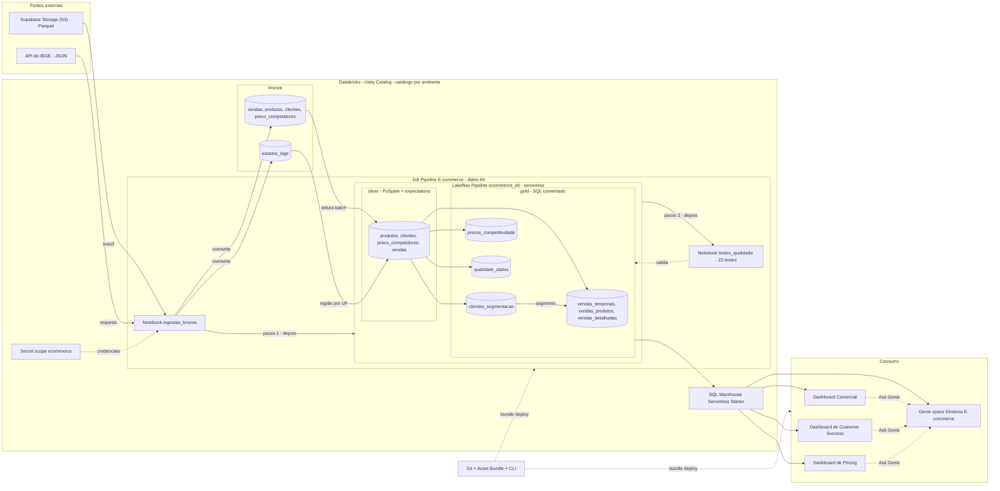

# Arquitetura: pipeline de e-commerce no Databricks

Documento de arquitetura da solução implantada no target `dev` e preparada para o target `prod`. Para a explicação didática de cada camada, veja o [Guia de estudo](./GUIA_DE_ESTUDO.md).

---

## 1. Visão de componentes

| # | Componente | Tecnologia | Responsabilidade | Onde está |
|---|---|---|---|---|
| 1 | Data lake de origem | Storage do Supabase (protocolo S3) | Guarda os 4 arquivos Parquet exportados pelo sistema | Externo |
| 2 | API do IBGE | REST/JSON (`servicodados.ibge.gov.br`) | Lista das 27 UFs com região | Externo |
| 3 | Secret scope | Databricks secrets | Endpoint e chaves do Storage do Supabase | Scope `ecommerce` |
| 4 | Ingestão | Notebook Python (`boto3`, `pandas`, `requests`) | Baixa arquivos e API, cria catálogo e schemas se preciso e grava a bronze (carga full) | `ecommerce/src/ingestao/ingestao_bronze.py` |
| 5 | Bronze | 5 tabelas Delta gerenciadas | Dado como chegou da origem | `<catalogo>.bronze` |
| 6 | Pipeline de transformação | Lakeflow Declarative Pipeline, serverless | Monta silver e gold na ordem certa e mede a qualidade | `ecommerce/resources/ecommerce_etl.pipeline.yml` |
| 7 | Silver | 4 materialized views em PySpark, com 19 expectations | Tipos, chaves, receita, calendário, região do IBGE, problemas marcados | `<catalogo>.silver` · `ecommerce/src/ecommerce_etl/transformations/silver/` |
| 8 | Gold | 6 materialized views em SQL, todas as colunas comentadas | Uma tabela por pergunta de diretoria, tabela larga por venda e placar de qualidade | `<catalogo>.gold` · `ecommerce/src/ecommerce_etl/transformations/gold/` |
| 9 | Testes de qualidade | Notebook Python (22 consultas) | Chaves, reconciliação de receita, limites, período, placar, comentários | `ecommerce/src/ecommerce_etl/testes/testes_qualidade.py` |
| 10 | Orquestração | Lakeflow Job, serverless, diário às 6h | `ingestao_bronze` → `atualizar_pipeline` → `testes_qualidade`, e-mail na falha | `ecommerce/resources/pipeline_ecommerce.job.yml` |
| 11 | SQL warehouse | Serverless Starter Warehouse (PRO, 2X-Small) | Executa o SQL de dashboards e Genie | Workspace (lookup pelo nome) |
| 12 | Dashboards | 3 dashboards AI/BI (Lakeview) | Comercial, Customer Success e Pricing | `ecommerce/src/dashboards/` · `ecommerce/resources/*.dashboard.yml` |
| 13 | Genie space | AI/BI Genie | Perguntas em português sobre as 6 golds | `ecommerce/resources/diretoria.genie_space.yml` |
| 14 | Governança | Unity Catalog | Catálogos por ambiente, permissões, comentários, linhagem | `ecommerce` (dev) · `ecommerce_prod` (prod) |
| 15 | Deploy | Databricks Asset Bundle + Databricks CLI | Implanta job, pipeline, dashboards e Genie a partir do Git | `ecommerce/databricks.yml` |
| 16 | Desenvolvimento assistido | Claude Code + plugin Databricks + MCP de SQL | Escreve código, consulta o workspace, testa o Genie | `.mcp.json.example`, `ecommerce/AGENTS.md` |

`<catalogo>` é `ecommerce` no target `dev` e `ecommerce_prod` no target `prod` (variável `catalog` do bundle).

---

## 2. Fluxo de dados

1. **Agendamento.** O Job roda todo dia às 6h (`America/Sao_Paulo`) em prod; em dev, só sob demanda.
2. **Ingestão.** O notebook lê endpoint e chaves do secret scope, baixa `vendas`, `produtos`, `clientes` e `preco_competidores` em Parquet e chama a API do IBGE. Cada fonte vira DataFrame (pandas → Spark) e é gravada com `overwrite` em `<catalogo>.bronze.<tabela>`. Se alguma tabela chegar vazia, a tarefa falha e nada mais roda.
3. **Silver.** O pipeline relê a bronze inteira (batch): corrige tipos, calcula receita e atributos de tempo, busca a região em `bronze.estados_ibge` e marca problemas em colunas. Expectations *fail* param o pipeline; expectations *warn* só medem.
4. **Gold.** Na mesma execução, as 6 MVs da gold leem a silver. `vendas_detalhadas` também lê `gold.clientes_segmentacao`, para usar o mesmo segmento; `qualidade_dados` resume as marcações da silver.
5. **Testes.** Terminado o pipeline, o notebook de testes roda 22 consultas. Qualquer contagem acima de zero deixa o Job vermelho e dispara o e-mail.
6. **Consumo.** Dashboards e Genie consultam só a gold, pelo SQL warehouse, com as permissões do Unity Catalog de quem está vendo (`embed_credentials: false`).
7. **Deploy.** Mudanças em código, dashboards ou Genie vão pelo Git e por `databricks bundle deploy`; ajuste feito pela interface é sobrescrito no próximo deploy. Num ambiente novo, a ordem é deploy → Job → deploy, porque o Genie só aceita tabelas que já existem.

---

## 3. Diagrama

Diagrama para importar no Excalidraw (*Mermaid to Excalidraw*). Linha tracejada = ligação de configuração, validação ou deploy.

---

## 4. Componentes e conexões (para desenhar à mão)

**Componentes**

| ID | Componente | Grupo |
|---|---|---|
| SUP | Supabase Storage (S3), Parquet | Fontes externas |
| IBGE | API do IBGE, JSON | Fontes externas |
| SEC | Secret scope `ecommerce` | Databricks |
| ING | Notebook `ingestao_bronze` (tarefa 1) | Job |
| B1 | bronze: vendas, produtos, clientes, preco_competidores | Unity Catalog / bronze |
| B2 | bronze: estados_ibge | Unity Catalog / bronze |
| S1 | silver: produtos, clientes, preco_competidores, vendas | Job / pipeline (tarefa 2) / silver |
| G1 | gold: vendas_temporais, vendas_produtos, vendas_detalhadas | Job / pipeline / gold |
| G2 | gold: clientes_segmentacao | Job / pipeline / gold |
| G3 | gold: precos_competitividade | Job / pipeline / gold |
| G4 | gold: qualidade_dados | Job / pipeline / gold |
| TST | Notebook `testes_qualidade` (tarefa 3) | Job |
| WH | SQL Warehouse "Serverless Starter Warehouse" | Databricks |
| D1, D2, D3 | Dashboard Comercial, Dashboard de Customer Success, Dashboard de Pricing | Consumo |
| GEN | Genie space "Diretoria E-commerce" | Consumo |
| DEV | Git + Asset Bundle + Databricks CLI | Desenvolvimento |

**Conexões**

| Origem | → | Destino | Rótulo | Tipo de linha |
|---|---|---|---|---|
| SUP | → | ING | boto3 (S3) | Contínua |
| IBGE | → | ING | requests (HTTP) | Contínua |
| SEC | → | ING | credenciais | Tracejada |
| ING | → | B1 | overwrite | Contínua |
| ING | → | B2 | overwrite | Contínua |
| B1 | → | S1 | leitura batch | Contínua |
| B2 | → | S1 | região por UF | Contínua |
| S1 | → | G1 | agregação e join | Contínua |
| S1 | → | G2 | agregação por cliente | Contínua |
| S1 | → | G3 | preço × concorrência | Contínua |
| S1 | → | G4 | contagem das marcações | Contínua |
| G2 | → | G1 | segmento do cliente | Contínua |
| ING | → | pipeline | tarefa 2 roda depois | Contínua |
| pipeline | → | TST | tarefa 3 roda depois | Contínua |
| TST | → | gold (G1..G4) | valida | Tracejada |
| G1..G4 | → | WH | consultas SQL | Contínua |
| WH | → | D1, D2, D3 | datasets dos dashboards | Contínua |
| WH | → | GEN | SQL gerado pelo Genie | Contínua |
| D1, D2, D3 | → | GEN | botão Ask Genie | Tracejada |
| DEV | → | Job, pipeline, D1..D3, GEN | bundle deploy | Tracejada |

---

## 5. Decisões de arquitetura (ADR)

Formato curto: **contexto → decisão → consequência**.

### ADR-001 · Medalhão no Unity Catalog, um catálogo por ambiente
- **Contexto:** três diretorias, volume pequeno, workspace Free Edition, dois ambientes (dev e prod).
- **Decisão:** schemas `bronze`, `silver` e `gold` num catálogo por ambiente: `ecommerce` em dev e `ecommerce_prod` em prod, pela variável `catalog` do bundle. No código, os nomes são sempre `schema.tabela`.
- **Consequência:** o mesmo código roda nos dois ambientes sem colisão. A primeira versão apontava os dois targets para `ecommerce`, e um deploy em prod criaria um segundo pipeline disputando as mesmas tabelas. Status: *resolvido*.

### ADR-002 · Materialized view, e não streaming table
- **Contexto:** a ingestão sobrescreve a bronze a cada carga.
- **Decisão:** todas as tabelas de silver e gold são MVs com leitura batch.
- **Consequência:** o pipeline relê a fonte inteira e recalcula (com refresh incremental quando o motor consegue). Uma streaming table quebraria com a sobrescrita. Se a origem passar a ser só acréscimo, vale reavaliar.

### ADR-003 · Marcar e medir, nunca descartar
- **Contexto:** 20 vendas de produto não cadastrado (R$ 4.240,01), 5 vendas antes do cadastro, 55 preços de concorrente suspeitos, 12 produtos com marca divergente do nome.
- **Decisão:** o problema vira coluna booleana e expectation *warn*; *fail* só para o que nunca pode acontecer. O placar vai para `gold.qualidade_dados`.
- **Consequência:** a receita bate em todas as camadas (R$ 974.077,28) e o problema fica visível para o time (event log) e para o diretor (placar e Genie). Quem consome precisa respeitar as colunas de alerta (ex.: `possui_preco_suspeito`).

### ADR-004 · Silver em Python, gold em SQL, um arquivo por tabela
- **Contexto:** a silver tem regex, joins de referência e regras de texto; a gold é agregação de negócio lida por analistas e pelo Genie.
- **Decisão:** `@dp.materialized_view` em PySpark na silver; `CREATE OR REFRESH MATERIALIZED VIEW` na gold; o porquê em comentário no topo de cada arquivo.
- **Consequência:** revisão por arquivo no Git e grafo montado pelo pipeline. Exige conhecer as duas linguagens.

### ADR-005 · Gold por pergunta + tabela larga, sem star schema
- **Contexto:** os consumidores são dashboards (um SQL por dataset) e um agente text-to-SQL.
- **Decisão:** uma tabela agregada por pergunta de diretoria, mais `vendas_detalhadas` no grão da venda para perguntas cruzadas.
- **Consequência:** menos joins e menos erro do Genie. Por outro lado, as regras de métrica (ticket médio, dia da semana) se repetem em comentários, instruções e SQL de widget, porque não há camada semântica. Metric views do Unity Catalog são o próximo passo natural.

### ADR-006 · Comentários da gold como contrato com o Genie, com período vigiado
- **Contexto:** o Genie só sabe o que está nas tabelas e no space; o dataset é uma foto fixa de 13/12/2025 a 11/01/2026.
- **Decisão:** toda coluna gold declara tipo e `COMMENT` na própria definição da MV; um teste falha se alguma ficar sem comentário e outro falha se o período real dos dados mudar.
- **Consequência:** a documentação sobrevive ao refresh e é versionada, e o período escrito nos textos não fica errado em silêncio: se o dado mudar, o Job fica vermelho até os textos serem atualizados. Atualizar continua manual. Status: *resolvido* (com teste).

### ADR-007 · Tudo como código num Asset Bundle, inclusive dashboards e Genie
- **Contexto:** ajustes feitos pela interface se perdem e não são revisáveis.
- **Decisão:** pipeline, job, 3 dashboards (`.lvdash.json`) e Genie no bundle. O *serialized space* do Genie fica dentro do YAML (`serialized_space`) para usar `${var.catalog}`; mudança só pelo arquivo + `bundle deploy`.
- **Consequência:** reprodutível e revisável nos dois ambientes. Limitação restante: o id do Genie no botão "Ask Genie" dos dashboards continua fixo no JSON (o dashboard inteiro no YAML ficaria ilegível). Num ambiente novo, o deploy do Genie só passa depois de o Job criar as tabelas. Status: *resolvido em parte*.

### ADR-008 · Compute 100% serverless
- **Contexto:** Free Edition, carga pequena, zero operação de cluster.
- **Decisão:** job e pipeline em serverless; dashboards e Genie no Serverless Starter Warehouse (auto-stop de 10 min).
- **Consequência:** nada para ligar ou desligar e custo proporcional ao uso. A primeira consulta do dia espera o warehouse subir.

### ADR-009 · Região do cliente pela tabela do IBGE
- **Contexto:** o cliente só tem a UF; a diretoria de CS precisa da região.
- **Decisão:** `silver.clientes` faz join com `bronze.estados_ibge`, gravada pela ingestão a partir da API do IBGE.
- **Consequência:** a fonte oficial é usada e não há lista de UFs para manter no código. A primeira versão usava um dicionário fixo e deixava `estados_ibge` sem uso; a troca não mudou nenhum cliente (0 divergências). A ingestão passa a depender da API do IBGE estar no ar. Status: *resolvido*.

### ADR-010 · Ingestão full por boto3, com credenciais no secret scope
- **Contexto:** a origem é um storage S3-compatível de terceiros, com arquivos pequenos.
- **Decisão:** notebook versionado com `boto3` + pandas, `overwrite` + `overwriteSchema`, endpoint e chaves lidos de `dbutils.secrets`, catálogo pelo parâmetro do Job; é a 1ª tarefa do Job.
- **Consequência:** simples, idempotente e sem segredo no Git, com o histórico Delta preservado. Sem incremental, sem cópia do arquivo bruto e sem colunas de controle. A primeira versão era um notebook solto, com as chaves no código e rodado à mão. Status: *resolvido*.

### ADR-011 · Testes entre tabelas num notebook depois do pipeline
- **Contexto:** expectations olham uma linha por vez e não enxergam outras tabelas.
- **Decisão:** notebook com 22 consultas que contam linhas com problema, rodado pelo Job depois do pipeline.
- **Consequência:** reconciliação de receita, chaves, período e placar garantidos a cada execução. Os dados já estão gravados quando o teste falha: o Job fica vermelho e avisa por e-mail, mas a gold com problema continua visível.

### ADR-012 · Um único Genie space para três diretorias
- **Contexto:** as perguntas cruzam diretorias ("canal preferido dos VIP").
- **Decisão:** um space com as 6 golds, 15 instruções curtas, 2 joins, 6 SQLs de exemplo e 1 medida; aceitação por 12 perguntas com resposta conhecida, mais as 6 da tela inicial e 2 de qualidade.
- **Consequência:** um ponto de manutenção só; placar de 10/10 e 2/2 nas rodadas 3 a 6. Toda tabela nova exige nova rodada completa (a `qualidade_dados` fez o Genie inventar uma regra na rodada 5). Se o escopo crescer, vale separar por diretoria.

---

## 6. Stack

| Camada | Tecnologia |
|---|---|
| Plataforma | Databricks (Free Edition) na AWS |
| Governança | Unity Catalog |
| Formato de tabela | Delta Lake (tabelas gerenciadas; *liquid clustering* em `vendas_detalhadas`) |
| Ingestão | Python, `boto3`, `pandas`, `requests`, Databricks secrets |
| Transformação | Lakeflow Declarative Pipelines (`pyspark.pipelines`), PySpark, Spark SQL |
| Qualidade | Expectations do pipeline, notebook de testes e placar `gold.qualidade_dados` |
| Orquestração | Lakeflow Jobs |
| Compute | Serverless (job e pipeline) e SQL warehouse serverless |
| BI | Dashboards AI/BI (Lakeview) |
| IA para o negócio | AI/BI Genie |
| Infra como código | Databricks Asset Bundles, Databricks CLI v1.17 |
| Desenvolvimento | Git, VS Code, Claude Code com plugin Databricks, MCP de SQL gerenciado |
| Fontes | Storage do Supabase (S3-compatível), API de localidades do IBGE |

---

## 7. Pontos em aberto

O `overrideId` dos dashboards em prod, CI/CD com service principal, grants para os diretores e os demais gaps estão na seção [Gaps para produção](./GUIA_DE_ESTUDO.md#7-gaps-para-produção) do guia.
