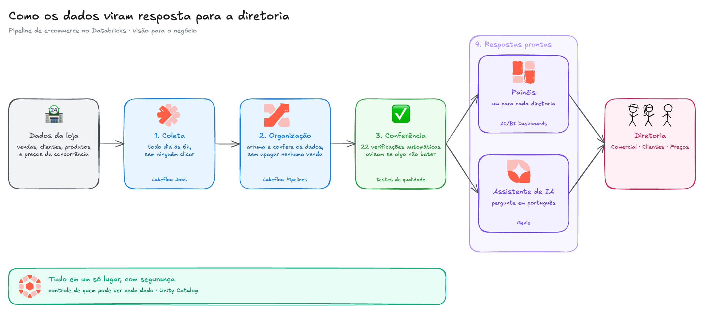
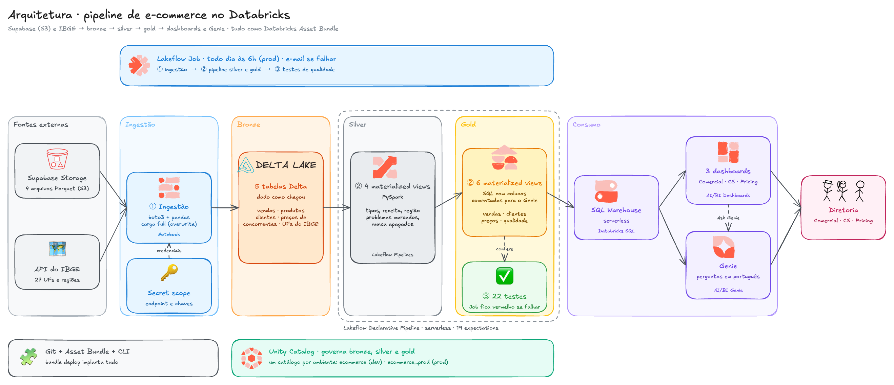

# Diagramas da arquitetura

Duas versões do mesmo diagrama, cada uma em três formatos.

| Versão | Para quem | Excalidraw (editável, com ícones) | Imagem | Mermaid |
|---|---|---|---|---|
| **Técnica** | Engenharia de dados, avaliação técnica | [arquitetura_tecnica.excalidraw](arquitetura_tecnica.excalidraw) | [arquitetura_tecnica.png](arquitetura_tecnica.png) | [arquitetura_tecnica.mmd](arquitetura_tecnica.mmd) |
| **Negócio** | Diretoria, gestores, recrutadores | [arquitetura_negocio.excalidraw](arquitetura_negocio.excalidraw) | [arquitetura_negocio.png](arquitetura_negocio.png) | [arquitetura_negocio.mmd](arquitetura_negocio.mmd) |

## Qual arquivo usar

- **`.excalidraw`**: a versão caprichada, com os ícones oficiais já posicionados. Abra em [excalidraw.com](https://excalidraw.com) pelo menu **Abrir** (ou arraste o arquivo para a tela). No VS Code, a extensão *Excalidraw* abre o arquivo direto. Cada caixa é um grupo: arrastar move retângulo, ícone e textos juntos, e um duplo clique entra no grupo para editar só uma parte. As setas estão presas às caixas e acompanham quando você move alguma.
- **`.png`**: para colar em README, apresentação ou post. Para exportar de novo depois de editar: **Exportar imagem...**, marque **Fundo**, escolha a **Escala** 2× e clique em **PNG**.
- **`.mmd`**: o texto-fonte em Mermaid. Serve para editar rápido e reimportar no Excalidraw em **Mais ferramentas → Mermaid para Excalidraw → Inserir**. O GitHub também desenha Mermaid direto no markdown. O layout importado é automático, sem ícones.

## Regras para o Mermaid importar bem no Excalidraw

Conferidas no código do conversor (`@excalidraw/mermaid-to-excalidraw` 2.2.2) e testadas antes de salvar estes arquivos:

| Recurso | Resultado no Excalidraw |
|---|---|
| Emoji no texto | Funciona. É o jeito de ter "ícone" direto do Mermaid |
| Cores com `classDef` e `style` (inclusive em subgraph) | Funcionam: preenchimento, borda e cor do texto |
| Linha tracejada `-.->` e linha grossa `==>` | Viram tracejada e grossa |
| Caixa arredondada `(" ")` e `([" "])` | Viram retângulo arredondado |
| Quebra de linha com ` ` | **Não funciona**: aparece escrito " " no desenho. Use rótulo markdown (texto entre crases dentro das aspas) e aperte Enter para quebrar a linha, como nos arquivos `.mmd` desta pasta |
| `_` dentro de rótulo markdown | **Some**: `preco_competidores` vira "precocompetidores" (o `_` é itálico em markdown) |
| Cilindro `[(" ")]` e hexágono `{{" "}}` | Viram retângulo comum |
| Ícones Font Awesome (`fa:fa-database`) | São **removidos** do texto |
| Rótulo em seta curta | Tende a ficar em cima das caixas; use só onde a seta é longa |

## Bibliotecas de ícones usadas

Todas do catálogo oficial [libraries.excalidraw.com](https://libraries.excalidraw.com), licença MIT. No Excalidraw: **Biblioteca** (canto superior direito) → **Procurar bibliotecas** → busque o nome no site que abre → **Add to Excalidraw**. Os ícones aparecem no painel da Biblioteca; é só arrastar para a tela.

| Biblioteca | Autor | Ícones usados aqui |
|---|---|---|
| [Databricks Architecture Icons](https://libraries.excalidraw.com/libraries/lukethorp/databricks-architecture-icons.excalidrawlib) | Luke Thorp | Lakeflow Jobs, Lakeflow Declarative Pipelines, Notebooks, Lakehouse, Databricks SQL, Dashboards, Genie, Unity Catalog |
| [Data Platform](https://libraries.excalidraw.com/libraries/chuqbach/data-platform.excalidrawlib) | Chu Quang Bach | S3 Bucket, Delta Lake |
| [Stick Figures](https://libraries.excalidraw.com/libraries/youritjang/stick-figures.excalidrawlib) | Youri Tjang | Guy, Girl, Stick man (a Diretoria) |

Outras que combinam com este projeto, se quiser variar:
- **Microsoft Fabric Architecture Icons** (Miles Cole), para desenhar o equivalente no Fabric lado a lado;
- **Dashboard Charts** (datavizfairy), com miniaturas de KPI e gráficos para ilustrar os painéis.

Onde ficou um emoji (🏪, 🗺️, 🔑, ✅, 🧩) é porque nenhuma dessas bibliotecas tem um ícone equivalente. Troque à vontade.
